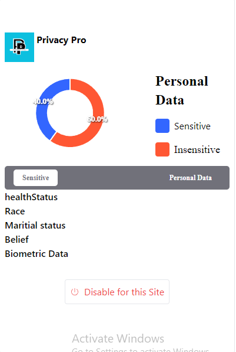

# Data privacy plugin

This application is build along with react with the help of manifest file and to provide only chrome browser to have an extension for protecting personal data

# The Dashboard of the extension
The dashboard shows the real time analytics for data entered in any form/site

# How to use it (developer mode)
- Go to chrome browser extensions 
 -Manage extensions
 -Enable developer mode

 -Run npm build in your application
 -Load unpacked
